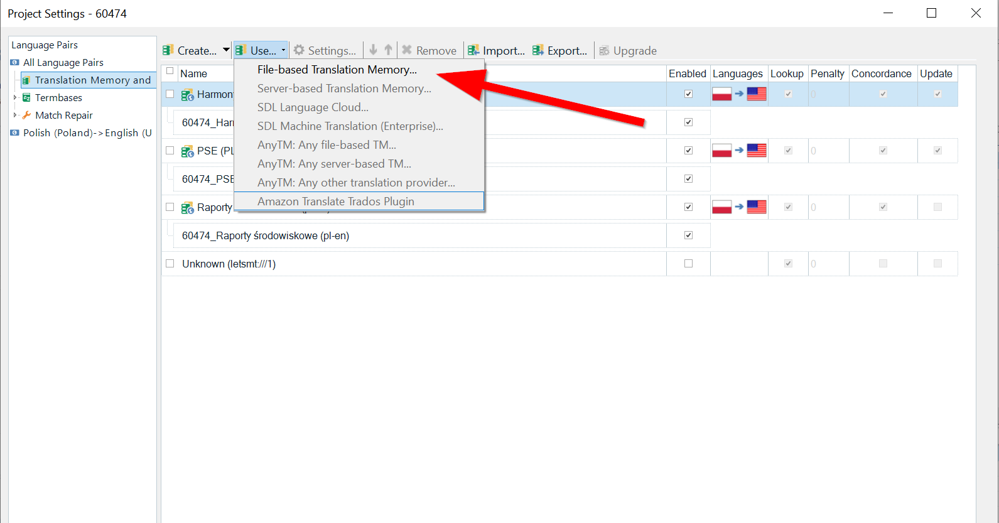
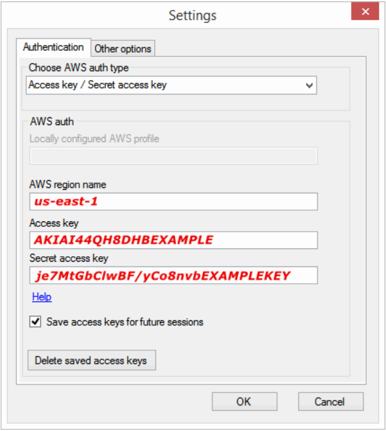
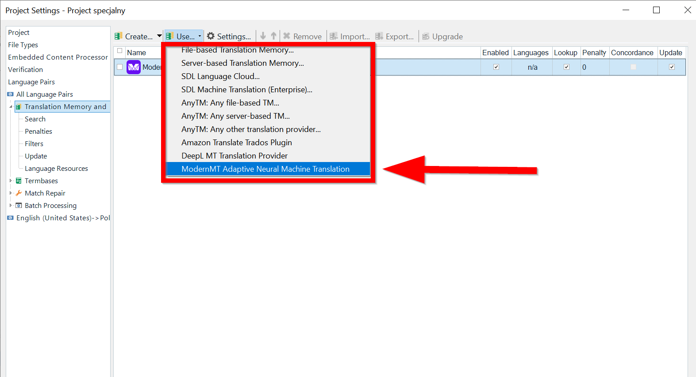
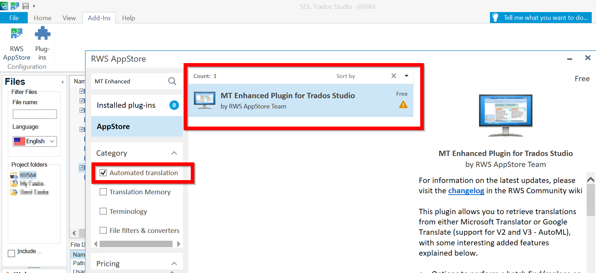

## 2. How to set up Trados Studio 2021™ plugins
### 2.1 Amazon Translate (AWS)
#### 2.1.1 How to obtain an API key
Refer to [Point 4.1](#41-amazon-translate-aws) for details.

#### 2.1.2 How to set up the Trados Studio 2021™ plugin for Amazon Translate (AWS)
 - Open your desktop version of Trados Studio 2021™.
 
 - Go to **Add-ins > RWS AppStore**. Search for **Amazon Translate MT Provider** and download it. Restart Trados Studio 2021™.
 
 - Go to **Project Settings**. In the **Translation Memory and Automated Translation** settings window select the provider by clicking **Use...** > **Amazon Translate Trados Plugin**.

<!--  -->

<!--  -->

- Enter necessary credentials in the **Authentication** window.

    - Select **Access key  / Secret access key** in the **Choose AWS auth type** drop-down menu.
		
    - Enter the **AWS region name**, **Access key**, and **Secret access key** credentials in the appropriate fields. Check the **Save access keys for future sessions** option.
    
     - Confirm by clicking **OK**.

The **Amazon Translate Trados Plugin** plugin is now visible in the **Translation Memory and Automated Translation** settings window. You may start using this service now.

### 2.2 DeepL
#### 2.2.1 How to obtain an API key
Refer to [Point 4.2](#42-deepl) for details.

#### 2.2.2 How to set up the Trados Studio 2021™ plugin for DeepL

- Open your desktop version of Trados Studio 2021™.

- Go to **Add-ins > RWS AppStore**. Search for **DeepL Translation Provider** and download it. Restart Trados Studio 2021™.

- Go to **Project Settings**. In the **Translation Memory and Automated Translation** settings window select the provider by clicking **Use...** > **DeepL MT Translation Provider**.

 - Enter the API key. Click **OK**.
 
 - Add the following domains to your firewall/antivirus exceptions: www2.deepl.com and www.api.deepl.com.
 
 - Please check if the API key is added correctly. Read this article for more information: [https://gateway.sdl.com/apex/communityknowledge?articleName=000013232](https://gateway.sdl.com/apex/communityknowledge?articleName=000013232)

The **DeepL MT Translation Provider** plugin is now visible in the **Translation Memory and Automated Translation** settings window. You may start using this service now.

### 2.3 ModernMT
#### 2.3.1 How to obtain an API key
Refer to [Point 4.3](#43-modernmt) for details.

#### 2.3.2 How to set up the Trados Studio 2021™ plugin for ModernMT
- Open your desktop version of Trados Studio 2021™.

- Go to **Add-ins > RWS AppStore**. Search for **ModernMT** and download it. Restart Trados Studio 2021™.

- Go to **Project Settings**. In the **Translation Memory and Automated Translation** settings window select the provider by clicking **Use...** > **Modern MT Adaptive Neural Machine Translation**.  

 - Enter the API key. Click **OK**.  

  
 
 - You may select one or more translation memories to use with your project. Check the **Use** check box for each translation memory you wish to use. If you check the **Update** check box of a translation memory, it will learn from the corrections you make in a given translation. You may select this check box for only one translation memory.  

  

The **Modern MT Adaptive Neural Machine Translation** plugin is now visible in the **Translation Memory and Automated Translation** settings window. You may start using this service now.  
### 2.4 Google Cloud Translation Basic (or Google Translate API v2)  
#### 2.4.1 How to obtain an API key  
Refer to [Point 4.4](#44-google-cloud-translation-basic-or-google-translate-api-v2) for details.  

#### 2.4.2 How to set up the Trados Studio 2021™ plugin for Google Cloud Translation Basic (or Google Translate API v2)  

- Open your desktop version of Trados Studio 2021™.  

- Go to **Add-ins > RWS AppStore**. Search for **MT Enhanced Plugin for Trados Studio** and download it.  

  

- Restart Trados Studio 2021™.  

- Go to **Project Settings**. In the **Translation Memory and Automated Translation** settings window select the provider by clicking **Use...** > **MT Enhanced Trados Plugin**.  

  

- Open the uppermost drop-down menu to choose which MT provider you want to use. Select **Google Translator**.  

- Below the uppermost drop-down menu, there is another one in which you can select which version of the Google Translate API you wish to use. Open it and select **V2-Basic Translation**.  

 - Enter the API key in the field below. Check the **Save Google key**.  
 
 - Click **OK**.  

  

The **MT Enhanced Plugin for Trados Studio** plugin is now visible in the **Translation Memory and Automated Translation** settings window. It is displayed as **MT Enhanced using Google Translate Basics** in the opened window. You may start using this service now.  

#### 2.4.3 How to set up the Google API Validator plugin for Trados Studio 2021™ (optional)  

This plugin is not required for the **Google Cloud Translation Basic (or Google Translate API v2)** service to work with Trados Studio 2021™, but it enhances the usability of this MT. The plugin has been developed to provide a simple and fast way to validate the credentials being used to access the Google Translate API.  

  

 - Open your desktop version of Trados Studio 2021™. 
 - Go to **Add-ins > RWS AppStore**. Search for **Google API Validator** and download it. By default, it is saved in the following destination: C:\Users\User1\AppData\Roaming\SDL Community\AppStore Integration\Downloads\GoogleApiValidator.Setup.zip.  
 
In your system, the \Users\User1 part of the path shown here will most likely be different. The path has been included here as an example, not a precise indication of the .zip file location.  

 - Install the file by clicking it and following the on-screen commands.  
 
 - After the plugin is installed, restart Trados Studio 2021™. The plugin is now ready for use.  
 
 More information on this plugin is available **[here](https://community.sdl.com/product-groups/translationproductivity/w/customer-experience/5493/google-api-validator).**

