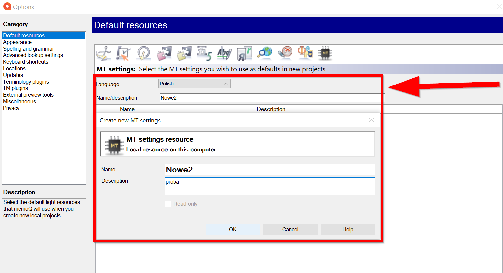
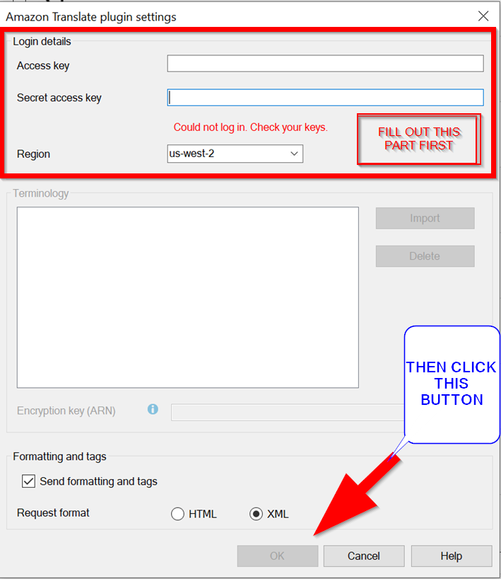
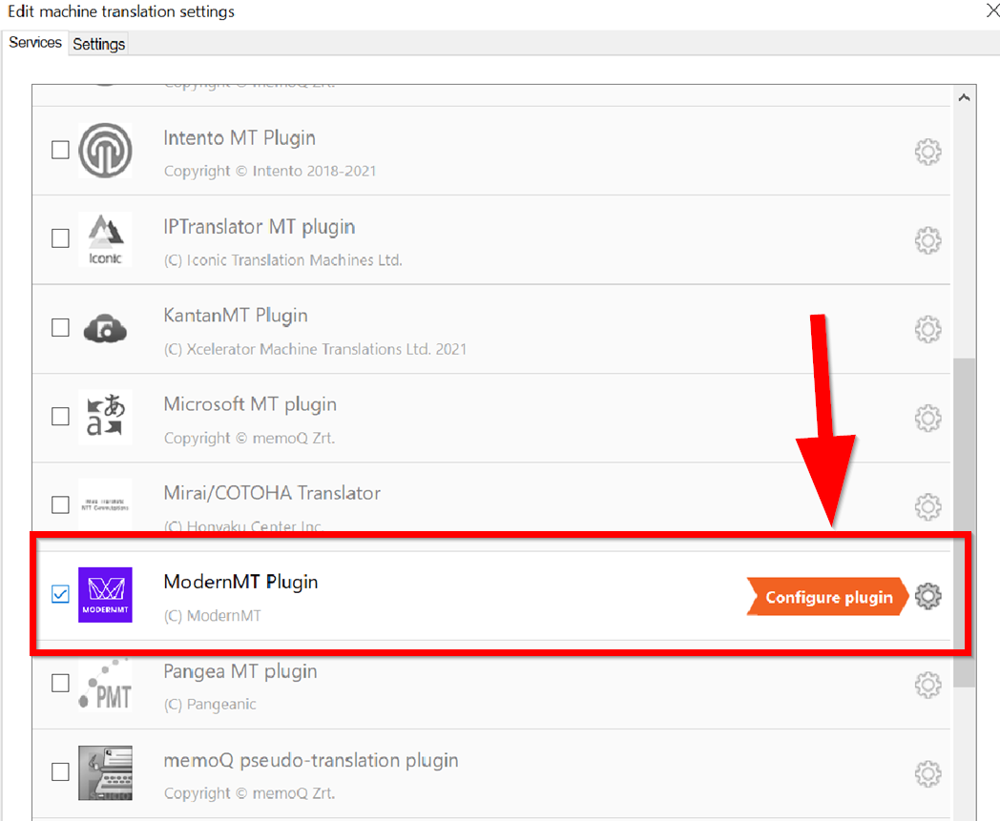
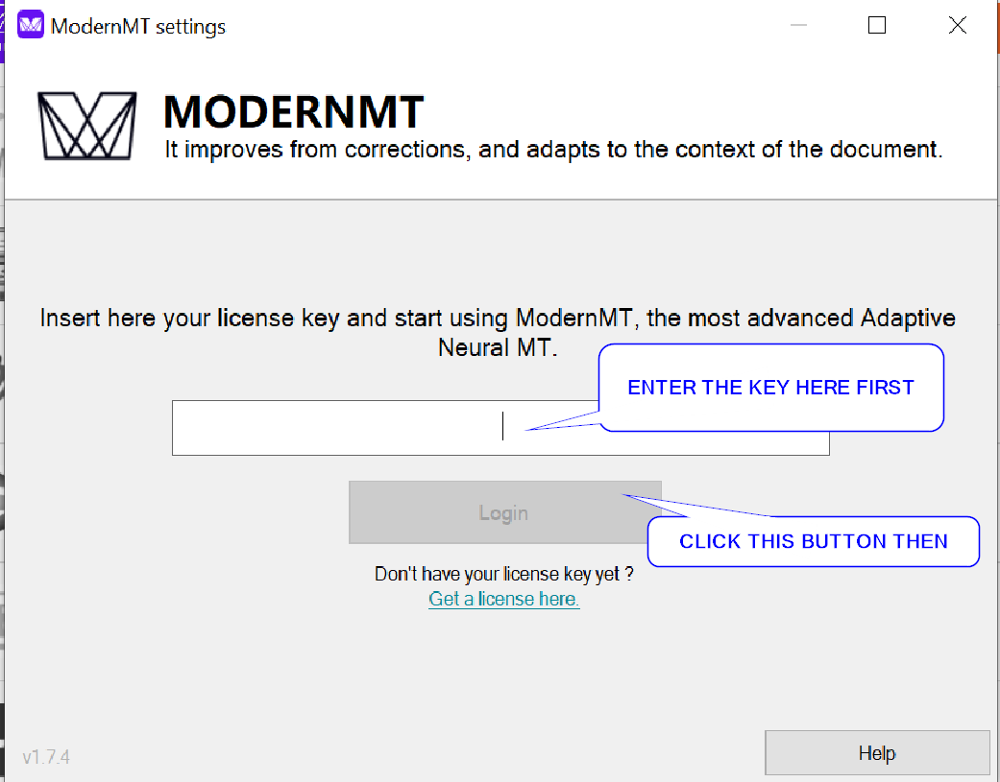
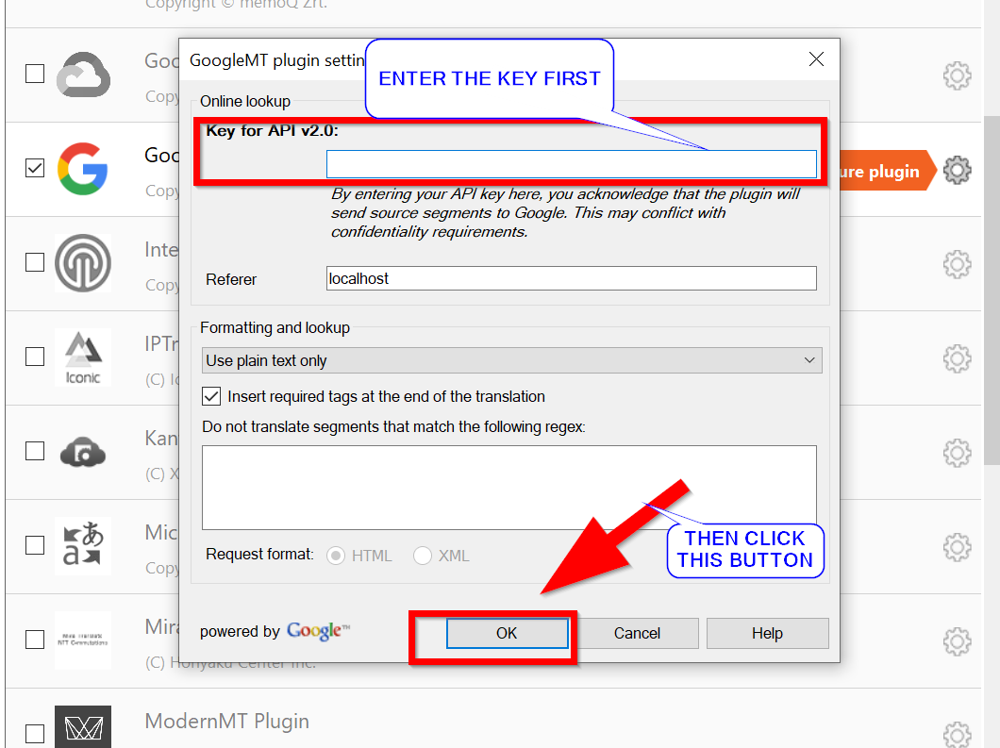

## 3. How to set up Memoq Translator Pro 9.8™ plugins  
### 3.1 Amazon Translate (AWS)
#### 3.1.1 How to obtain an API key
Refer to [Point 4.1](#41-amazon-translate-aws) for details.

#### 3.1.2 How to set up the Memoq Translator Pro 9.8™ plugin for Amazon Translate (AWS) (for a local profile)

 - Click **memoQ** tab in the upper, left corner of the dashboard.
 

 - Click **Options**. A new pane appears. Click **Options** in the **memoQ options** menu. Wait for the **Default resources** pane to open.
 

 -  At the top of the pane, there is a row of icons. Click the **MT Settings** icon, which is the first icon from the right.
 
 - If you have already set up an MT profile or profiles, select one of them from the list and click **OK** to confirm that you read the message > **Edit**.
	

  - If you have not set up an MT profile yet, open the **Language** drop-down menu, and select a language. In the **Name/description** field enter a name. Click **Create new** at the bottom of the pane. In the **Create new MT settings** window enter the name and description.
	Click **OK**. Check the new profile visible in the list. Click **OK** to confirm that you read the message > **Edit**.
	

 - In the **Edit machine translation settings** windows go to the **Services** tab and check the **AWS Amazon Translate** plugin. Click **OK** to confirm that you read the message. To prevent this message from displaying again, check **Do not show this warning** option. Click the cogwheel icon or double-click the name of the plugin.

 
 - In the **Amazon Translate plugin settings** enter your Access key and Secret access key in the two text fields. Select your region from the Region drop-down menu. It must be the same region as the one specified in your Amazon credentials. More information about other options available in this window is available **[here](https://docs.memoq.com/current/en/Places/amazon-mt-plugin-settings.html)**.  Click **OK**, then click **OK** again.
 

You may start using this service now.

### 3.2 DeepL
#### 3.2.1 How to obtain an API key
Refer to [Point 4.2](#42-deepl) for details.

#### 3.2.2 How to set up the Memoq Translator Pro 9.8™ plugin for DeepL
- Click **memoQ** tab in the upper, left corner of the dashboard.

- Click **Options**. A new pane appears. Click **Options** in the **memoQ options** menu. Wait for the **Default resources** pane to open.

 
- At the top of the pane, there is a row of icons. Click the **MT Settings** icon, which is the first icon from the right.

- If you have already set up an MT profile or profiles, select one of them from the list and click **OK** to confirm that you read the message > **Edit**.

 
- If you have not set up an MT profile yet, open the **Language** drop-down menu, and select a language. In the **Name/description** field enter a name. Click **Create new** at the bottom of the pane. In the **Create new MT settings** window enter the name and description. Click **OK**. Check the new profile visible in the list. Click **OK** to confirm that you read the message > **Edit**.
	

 
 - In the **Edit machine translation settings** windows go to the **Services** tab and check the **DeepL MT Plugin**. Click **OK** to confirm that you read the message. To prevent this message from displaying again, check **Do not show this warning** option. Click the cogwheel icon or double-click the name of the plugin.

 - In the **DeepL MT plugin settings** enter your DeepL API key in the **Auth key** field.  Click  **OK**.  Check the  **Enable plugin**  check box in the list of machine translation plugins. Click  **OK**  again to close the  **Options**  dialog.

 

You may start using this service now.

### 3.3 ModernMT
#### 3.3.1 How to obtain an API key
Refer to [Point 4.3](#43-modernmt) for details.

#### 3.3.2 How to set up the Memoq Translator Pro 9.8™ plugin for ModernMT
- Click **memoQ** tab in the upper, left corner of the dashboard.

- Click **Options**. A new pane appears. Click **Options** in the **memoQ options** menu. Wait for the **Default resources** pane to open.

 - At the top of the pane, there is a row of icons. Click the **MT Settings** icon, which is the first icon from the right. 
 
 - If you have already set up an MT profile or profiles, select one of them from the list and click **OK** to confirm that you read the message > **Edit**.

 - If you have not set up an MT profile yet, open the **Language** drop-down menu, and select a language. In the **Name/description** field enter a name. Click **Create new** at the bottom of the pane. In the **Create new MT settings** window enter the name and description. Click **OK**. Check the new profile visible in the list. Click **OK** to confirm that you read the message > **Edit**.
	

 - In the **Edit machine translation settings** windows go to the **Services** tab and check the **Modern MT Plugin**. Click **OK** to confirm that you read the message. To prevent this message from displaying again, check **Do not show this warning** option. Click the cogwheel icon or double-click the name of the plugin.

 
 
 - In the **Modern MT settings** enter your Modern MT API key in the field. Click  **Login**.  

   
 
  - You may select one or more translation memories to use with your project. Check the **Use** check box for each translation memory you wish to use. If you check the **Update** check box of a translation memory, it will learn from the corrections you make in a given translation. You may select this check box for only one translation memory.  
 
   
 
You may start using this service now.

### 3.4 Google Cloud Translation Basic (or Google Translate API v2)
#### 3.4.1 How to obtain an API key
Refer to [Point 4.4](#44-google-cloud-translation-basic-or-google-translate-api-v2) for details.

#### 3.4.2 How to set up the Memoq Translator Pro 9.8™ plugin for Google Cloud Translation Basic (or Google Translate API v2)

- Click **memoQ** tab in the upper, left corner of the dashboard.

- Click **Options**. A new pane appears. Click **Options** in the **memoQ options** menu. Wait for the **Default resources** pane to open.
 

 
  - At the top of the pane, there is a row of icons. Click the **MT Settings** icon, which is the first icon from the right.
 
  - If you have already set up an MT profile or profiles, select one of them from the list and click **OK** to confirm that you read the message > **Edit**.
  

  - If you have not set up an MT profile yet, open the **Language** drop-down menu, and select a language. In the **Name/description** field enter a name. Click **Create new** at the bottom of the pane. In the **Create new MT settings** window enter the name and description. Click **OK**. Check the new profile visible in the list. Click **OK** to confirm that you read the message > **Edit**.

  - In the **Edit machine translation settings** windows go to the **Services** tab and check the **Google Cloud Translation Basic plugin**. Click **OK** to confirm that you read the message. To prevent this message from displaying again, check **Do not show this warning** option. Click the cogwheel icon or double-click the name of the plugin.
 

 
 - In the **Google MT Plugin settings** enter your Google API key in the **Key for API v2.0** field. Do not change the text in the **Referer**  box. Click  **OK**.  Check the  **Enable plugin**  check box in the list of machine translation plugins. Click  **OK**  again to close the  **Options**  dialog.
 

 
You may start using this service now.
