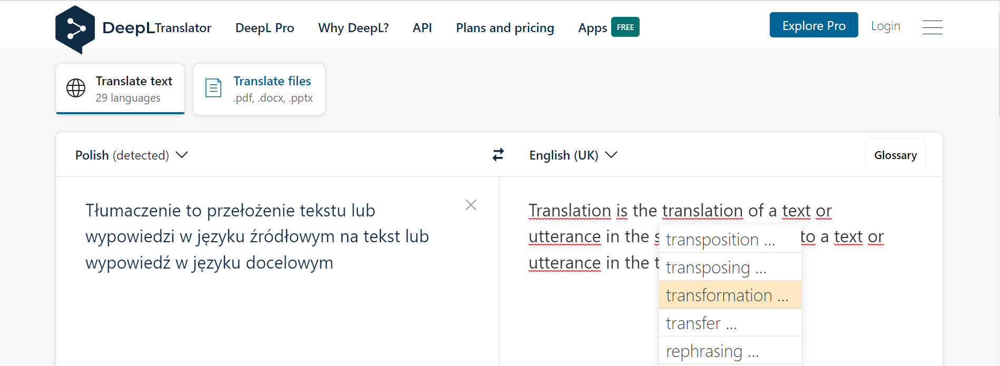

Authors and localisation engineers can use machine translation to quickly **draft content** in a natural language. 

## Use cases

### Mock-up localisation

Raw machine-translated text is a good mock-up to verify how the target language appears in localised content, such as:

- web pages
- user interface
- images and diagrams

The goal is to check target language features such as alphabet and typical word or sentence length instead of translation accuracy. 
When applied to localised content, machine translation is used to detect potential localisation issues, for example:

- corrupted or missing target characters
- truncated words or phrases due to lack of screen space
- unsuitable sort order in target language

Detecting these issues at an early phase allows taking corrective actions, in parallel with the actual professional translation or [post-editing](post-editing.md), or planning for necessary post-processing of localised content, for example:

- Enable proper locale, character sets and fonts.
- Resize assets for various text lengths, or plan for resizing these assets at the time of translation.
- Enable sorting in the target locales.

<!-- example of mock-up UI localisation with national characters corrupted -->

<!-- example of mock-up image localisation with text truncated -->

#### Example

The source image in English relies on the exact length of English text: 

Localised images will have different text lengths depending on the target language. For example, German text is usually longer and does not fit, so some work is needed after the translation to adjust the localised images:

<!-- example of mock-up UI localisation with wrong sorting of a translated list -->

### Writing aid

Authors can use machine translation to draft a text in foreign language which they know, but can use some help with typical expressions and appropriate phrases. 

#### Workflow

- Authors write paragraphs in their native language.
- Authors edit the machine output for accuracy (conveying the message), terminology and consistency. 

This technique omits the basic difficulty of post-editing: while the post-editor needs some effort to understand the source, the original author knows exactly what they want to communicate. 

<!-- example of drafting text in DeepL -->

#### Example

An author may use DeepL in the browser to draft an English paragraph from a Polish source.

